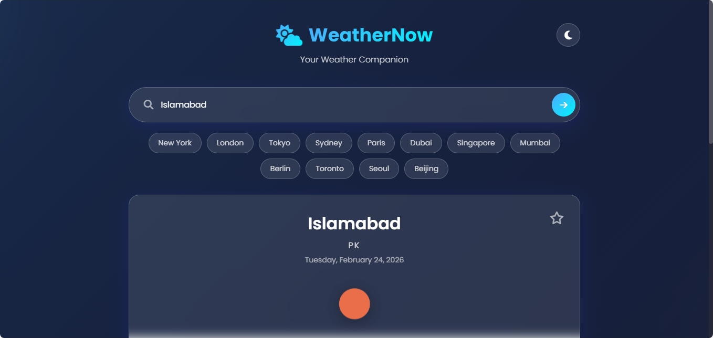
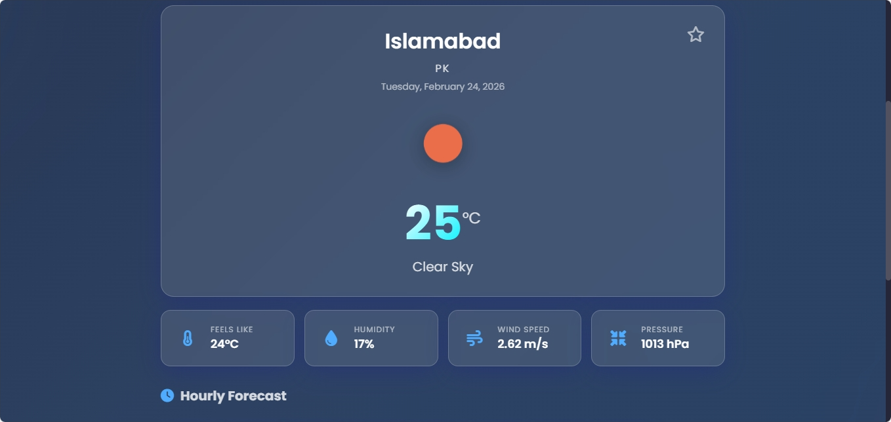
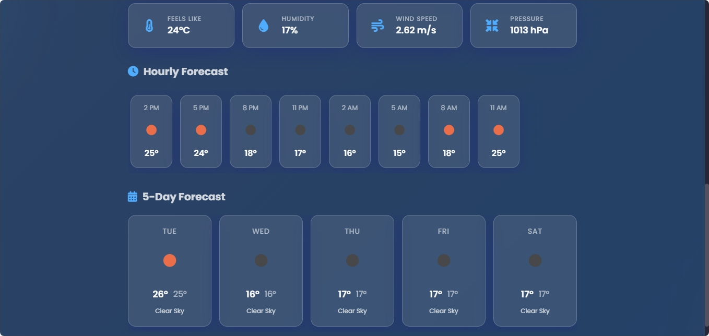

## Weather App Screenshot

### Dashboard


### Front Page


### Hourly Forecast


# WeatherNow - Modern Weather Web App

A beautiful, modern weather web application that provides real-time weather information and 5-day forecasts for cities around the world. Built with vanilla HTML, CSS, and JavaScript.


## Features

- **City Search** - Search weather by city name with instant results
- **Current Weather Display** - Shows temperature, weather description, humidity, and wind speed
- **Weather Icons** - Dynamic weather icons based on conditions
- **5-Day Forecast** - Extended forecast with daily high/low temperatures
- **Favorite Cities** - Save favorite cities to access quickly (stored locally)
- **Responsive Design** - Works perfectly on desktop, tablet, and mobile devices
- **Modern UI** - Glassmorphism cards, gradient backgrounds, and smooth animations
- **Error Handling** - Graceful handling of invalid cities and API errors
- **Loading States** - Visual feedback during data fetching

## Tech Stack

- **HTML5** - Semantic markup
- **CSS3** - Modern styling with animations and gradients
- **JavaScript (ES6+)** - Vanilla JavaScript for interactivity
- **OpenWeatherMap API** - Weather data source

## How to Run

1. **Clone or download the repository**
   
```
bash
   git clone <repository-url>
   cd Weather_App
   
```

2. **Open the application**
   - Simply open `index.html` in your browser
   - Or use a local server:
     
```
bash
     # Using Python
     python -m http.server 8000
     
     # Using Node.js
     npx serve
     
```
   - Then visit `http://localhost:8000`

3. **Start searching!**
   - Enter a city name in the search box
   - Press Enter or click the search button
   - Click the star icon to save cities to favorites

## Project Structure

```
Weather_App/
├── index.html          # Main HTML file
├── css/
│   └── style.css       # All styles
├── js/
│   └── app.js          # Application logic
├── screenshots/        # Project screenshots
├── .gitignore          # Git ignore file
└── README.md           # This file
```

## Design Highlights

- **Glassmorphism Effect** - Frosted glass cards for weather data
- **Animated Gradient Background** - Smooth color transitions
- **Micro-interactions** - Button hover effects and transitions
- **Mobile-First** - Fully responsive at all breakpoints

## API Key

This project uses the OpenWeatherMap API. The demo includes a public API key for testing purposes. For production use, obtain your own free API key from [OpenWeatherMap](https://openweathermap.org/api).

##  License Saim Bakhtiar

MIT License - Feel free to use this project for learning or personal projects.
